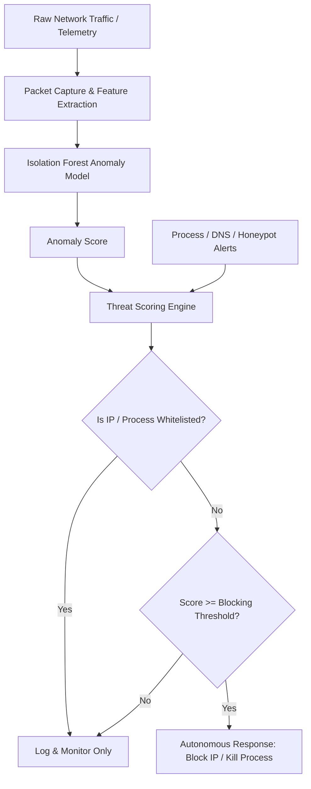

# Autonomous Cyber Defence System - Project Analysis

## Overview

This project is an **Autonomous Cyber Defence System**, a next-generation Intrusion Detection System (IDS) and Intrusion Prevention System (IPS) built in Python. It provides real-time monitoring, threat detection, and automated response capabilities for cybersecurity. The system integrates machine learning (Scikit-Learn Isolation Forest) for anomaly detection, a Flask web dashboard, SQLite for data storage, and various monitoring modules to detect and mitigate cyber threats autonomously.

## Project Structure

```
Autonomous Cyber Defence system/
├── app.py                          # Main Flask web application
├── database.py                     # SQLite database operations
├── process_monitor.py              # Process and window activity monitoring
├── persistence_monitor.py          # Persistence mechanism detection
├── packet_capture.py               # Network packet capture and analysis
├── traffic_analyzer.py             # Traffic behavior analysis
├── threat_engine.py                # Threat scoring and decision engine
├── correlation_engine.py           # Alert correlation engine
├── firewall.py                     # Firewall rule management
├── website_analyzer.py             # Domain analysis for phishing/malware
├── find_iface.py                   # Network interface detection
├── check_status.py                 # System status checking
├── decision_engine.py              # Decision-making logic
├── verify_system.py                # System verification utilities
├── cyber_defense.db                # SQLite database file
├── __pycache__/                    # Python bytecode cache
├── static/                         # Static web assets
│   ├── css/
│   │   └── styles.css              # Dashboard styling
│   └── js/
│       └── dashboard.js            # Dashboard JavaScript
├── templates/                      # HTML templates
│   ├── index.html                  # Main dashboard
│   └── blocked.html                # Blocked domain page
├── venv/                           # Python virtual environment
└── .git/                           # Git repository
```

## Detailed File Explanations

### Core Application Files

#### `app.py` (Main Application)

- **Purpose**: Flask web server that serves the dashboard and provides REST APIs
- **Key Features**:
  - Serves web dashboard at `http://localhost:5000`
  - Intercepts requests to block malicious domains
  - Provides APIs for stats, events, network data, threats, and DNS monitoring
  - Initializes all monitoring modules on startup
  - Checks for administrator privileges (required for firewall operations)
- **APIs Provided**:
  - `/api/stats`: System statistics
  - `/api/events`: Recent events
  - `/api/network/*`: Network monitoring data
  - `/api/threats`: Threat intelligence
  - `/api/blocked`: Blocked entities

#### `database.py` (Data Layer)

- **Purpose**: Handles all database operations using SQLite
- **Tables**:
  - `events`: HTTP requests, system events
  - `actions`: Blocking/unblocking actions
  - `blocked_entities`: Currently blocked IPs/domains
  - `threat_events`: Threat scoring events
  - `visited_domains`: DNS query history
- **Functions**: CRUD operations, statistics, top IPs, DNS history

### Monitoring Modules

#### `process_monitor.py` (Process Monitoring)

- **Purpose**: Monitors system processes and user activity
- **Features**:
  - Tracks active window titles
  - Detects new processes and suspicious parent-child relationships
  - Monitors resource usage (CPU, memory)
  - Terminates malicious processes based on threat scores
  - Integrates with threat engine for IP correlation

#### `persistence_monitor.py` (Persistence Detection)

- **Purpose**: Detects malware persistence mechanisms
- **Monitors**:
  - Windows Registry startup entries (Run/RunOnce keys)
  - Scheduled Tasks
  - Windows Services
- **Alerts**: Reports suspicious persistence to threat engine

#### `packet_capture.py` (Network Packet Capture)

- **Purpose**: Captures and analyzes network traffic
- **Features**:
  - Uses Scapy for deep packet inspection (if available)
  - Falls back to psutil for connection monitoring
  - Classifies IPs as EXTERNAL/INTERNAL/LOOPBACK
  - Tracks packet metadata, throughput, and interface stats
  - Stores packets in a ring buffer for analysis

#### `traffic_analyzer.py` (Traffic Analysis)

- **Purpose**: Analyzes network traffic patterns for anomalies
- **Detection Capabilities**:
  - Port scanning (sequential/random)
  - Connection bursts (DDoS-like behavior)
  - Brute force attacks on common ports
  - High-risk port connections (malware C2)
  - Traffic spikes (abnormal data transfer)
- **Maintains**: Per-IP behavioral profiles with threat scores

#### `threat_engine.py` (Threat Scoring Engine)

- **Purpose**: Central threat assessment and response system
- **Features**:
  - Accumulates threat scores from multiple sources
  - Smart blocking: requires evidence before action
  - Auto-unblocks after cooldown period
  - Threat levels: NORMAL → SUSPICIOUS → MALICIOUS → CRITICAL
  - Integrates with firewall for IP/domain blocking

#### `correlation_engine.py` (Alert Correlation)

- **Purpose**: Correlates alerts to detect attack chains
- **Features**:
  - Groups related alerts by IP and time window
  - Identifies multi-vector attacks
  - Boosts threat scores for correlated events
  - Builds forensic timeline of attacks

### Security Components

#### `firewall.py` (Firewall Management)

- **Purpose**: Manages Windows Firewall rules and hosts file
- **Functions**:
  - Blocks/unblocks IPs using `netsh` commands
  - Blocks domains by modifying hosts file
  - Requires administrator privileges
  - Safety checks to prevent blocking localhost

#### `website_analyzer.py` (Domain Analysis)

- **Purpose**: Analyzes domains for phishing/malware indicators
- **Heuristics**:
  - Keyword detection (login, secure, banking, etc.)
  - Entropy analysis for DGA domains
  - Structural checks (length, numbers, TLDs)
  - Whitelist for common safe domains

### Utility Scripts

#### `find_iface.py`

- **Purpose**: Network interface discovery and configuration

#### `check_status.py`

- **Purpose**: System health and status monitoring

#### `decision_engine.py`

- **Purpose**: Decision-making logic for automated responses

#### `verify_system.py`

- **Purpose**: System verification and integrity checks

### Web Interface

#### `templates/index.html` (Main Dashboard)

- **Purpose**: Web-based SOC dashboard
- **Features**:
  - Real-time statistics and charts
  - Multiple tabs: Overview, Network, Packets, DNS, Threats, Blocked
  - Interactive visualizations using Chart.js
  - Live updates via JavaScript

#### `templates/blocked.html` (Block Page)

- **Purpose**: Displayed when accessing blocked domains
- **Features**: Clean, professional block notification

#### `static/css/styles.css` (Styling)

- **Purpose**: Cyberpunk-themed CSS for the dashboard
- **Features**: Dark theme, gradients, animations, responsive design

#### `static/js/dashboard.js` (Dashboard Logic)

- **Purpose**: Client-side JavaScript for dashboard functionality
- **Features**:
  - Tab switching and navigation
  - Real-time data fetching and updates
  - Chart rendering with Chart.js
  - Packet display, threat monitoring, DNS history

### Data and Environment

#### `cyber_defense.db` (Database)

- **Purpose**: SQLite database storing all system data
- **Contains**: Events, actions, blocked entities, threat data, DNS history

#### `venv/` (Virtual Environment)

- **Purpose**: Isolated Python environment for dependencies

#### `__pycache__/` (Cache)

- **Purpose**: Compiled Python bytecode cache

#### `.git/` (Version Control)

- **Purpose**: Git repository for source code management

## System Architecture

1. **Data Collection Layer**:
   - `packet_capture.py`: Captures network packets
   - `process_monitor.py`: Monitors system processes
   - `persistence_monitor.py`: Detects persistence mechanisms

2. **Analysis & Machine Learning Layer**:
   - `traffic_analyzer.py`: Analyzes traffic patterns and extracts features.
   - `website_analyzer.py`: Analyzes domains.
   - `correlation_engine.py`: Correlates alerts.
   - **ML Pipeline**: `Network telemetry → feature extraction → anomaly model (Isolation Forest) → anomaly score → threat scoring → response engine`.

3. **Decision Layer**:
   - `threat_engine.py`: Aggregates rule-based alerts and ML anomaly scores to make deterministic blocking decisions.
   - `decision_engine.py`: Additional decision logic.

4. **Action Layer**:
   - `firewall.py`: Executes blocking actions (respecting trusted entities whitelist).
   - `database.py`: Logs all activities.

5. **Presentation Layer**:
   - `app.py`: Flask web server.
   - Web dashboard: Real-time SOC interface with safety controls.

### Architecture Diagram



## Key Features

- **Machine Learning Integration**: Unsupervised anomaly detection using Isolation Forest to identify zero-day network traffic variances.
- **Real-time Monitoring**: Continuous monitoring of network, processes, and system activity.
- **Threat Intelligence**: Advanced threat scoring with multiple detection vectors.
- **Automated Response**: Intelligent blocking of malicious IPs and domains, with built-in Safety Controls and Rollback (Unblock) functions.
- **Web Dashboard**: Professional SOC interface with real-time updates.
- **Deep Packet Inspection**: Detailed network traffic analysis.
- **Process Behavior Analysis**: Detection of suspicious process activity.
- **DNS Monitoring**: Tracking and analysis of DNS queries.
- **Persistence Detection**: Identification of malware persistence mechanisms.
- **Correlation Engine**: Multi-event correlation for attack chain detection.

## Benchmark Results (NSL-KDD / KDD Cup 99)

*Note: Results are generated using the `benchmark_report.py` script on standard intrusion detection datasets.*

- **Model**: Isolation Forest
- **Dataset**: KDD Cup 99 (Subset)
- **Accuracy**: *TBD (See benchmark script output)*
- **Precision**: *TBD*
- **Recall**: *TBD*
- **False Positive Rate**: *TBD*

## Requirements

- Python 3.x
- Flask
- Scapy (optional, for deep packet inspection)
- psutil
- SQLite3
- Administrator privileges (for firewall operations)
- Windows (primarily designed for Windows with Windows Firewall)

## Usage

1. Run with administrator privileges: `python app.py`
2. Access dashboard at `http://localhost:5000`
3. Monitor real-time threats and system activity
4. Review blocked entities and use the Whitelist/Unblock tools to prevent False Positives.
5. Benchmark the ML model by running: `python benchmark_report.py`

## References

1. **Scikit-Learn Documentation**: 
   - [Isolation Forest](https://scikit-learn.org/stable/modules/generated/sklearn.ensemble.IsolationForest.html) - For unsupervised anomaly detection algorithms.
2. **Dataset Documentation**:
   - [NSL-KDD / KDD Cup 99](https://www.unb.ca/cic/datasets/nsl.html) - Standard dataset for intrusion detection systems.
3. **Research Literature**:
   - Liu, Fei Tony, Kai Ming Ting, and Zhi-Hua Zhou. "Isolation forest." *Eighth IEEE International Conference on Data Mining*. IEEE, 2008. (Foundational paper for the algorithm used in this engine).
4. **Networking Protocols**:
   - [QUIC Protocol Specification](https://datatracker.ietf.org/doc/html/rfc9000) (RFC 9000) - Supported in the deep packet inspection capabilities.
   
This system provides comprehensive cybersecurity monitoring, validated machine learning detection, and safe automated defense capabilities suitable for protecting systems from various cyber threats.
