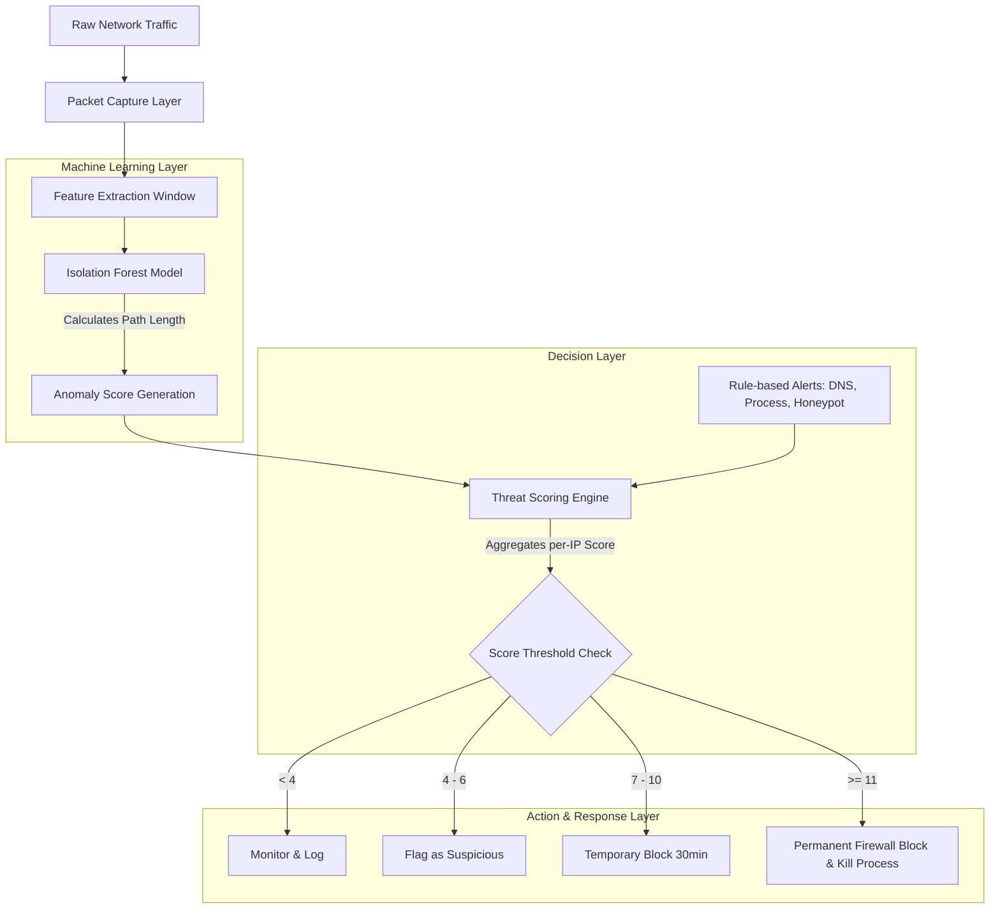

# Autonomous AI Cyber Response Engine - Research Documentation

## 1. Machine Learning Anomaly Detection Model

### Model Selection: Isolation Forest
The platform utilizes **Isolation Forest** (from `scikit-learn`) as its core machine learning model for detecting anomalous network behavior.

#### Why Isolation Forest?
1. **Efficiency on High-Dimensional Data**: Network telemetry generates multivariate time-series data with many features (packet rate, byte counts, port variance). Isolation Forest handles high-dimensional datasets without requiring heavy dimension reduction.
2. **Unsupervised Anomaly Detection**: In real-world deployments, finding a perfectly labeled dataset of all possible zero-day attacks is impossible. Isolation Forest operates entirely on the assumption that anomalies are "few and different" and isolates them without needing explicit labels of malicious vs. benign during inference.
3. **Low Computational Overhead**: O(n) time complexity and low memory requirements make it ideal for real-time traffic analysis integrated directly into a live SOC environment.

### How It Detects Anomalies in Network Telemetry
Isolation Forest works by randomly selecting a feature and randomly selecting a split value between the maximum and minimum values of that feature. Since anomalies are mathematically distant from normal observations (both in terms of feature values and density), they require fewer random partitions to be isolated. 

**Detection Mechanism on Telemetry**:
- **Features Extracted**: Packet size, flow duration, protocol types, request frequency, flag distributions (SYN/ACK ratios).
- **Path Length**: During monitoring, the system extracts these features in sliding windows and passes them to the Isolation Forest tree ensemble. A short average path length indicates an anomaly (e.g., a sudden SYN flood or weird payload sizes), whereas regular traffic yields longer path lengths.

### Integration with the Threat Scoring Engine
The Isolation Forest model does not directly enforce firewall blocks; it acts as a highly sensitive sensory organ feeding into the deterministic **Threat Scoring Engine**.

1. **Prediction**: Traffic vector is fed into the model.
2. **Anomaly Score**: The model outputs an anomaly score (typically normalized between -1 and 1, or scaled up).
3. **Engine Evaluation**: This anomaly score is scaled and assigned as `score_delta` within the `ThreatScoringEngine`. 
4. **Cumulative Risk**: The IP's cumulative threat state is updated. If the accumulated score from ML-based anomalies (e.g., 5 points) and deterministic rules (e.g., Honeypot hit = +10 points) crosses the blocking threshold (score >= 11), the threat engine executes an automated response.

---

## 2. System Architecture Pipeline

The anomaly detection and response loop follows a strict pipeline to ensure low-latency decisions.

---

## 3. Threat Engine Fallback
If the ML model detects high variance but the traffic doesn't trigger a deterministic IPS rule, the threat score increases into the "Log/Suspicious" range. This provides visibility to SOC analysts on the Dashboard without risking a False Positive auto-block on a legitimate, but unusual, user.
